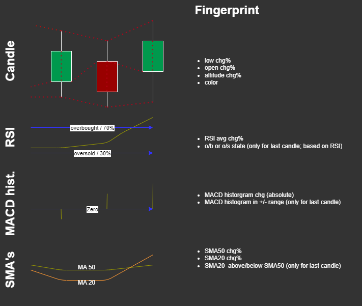
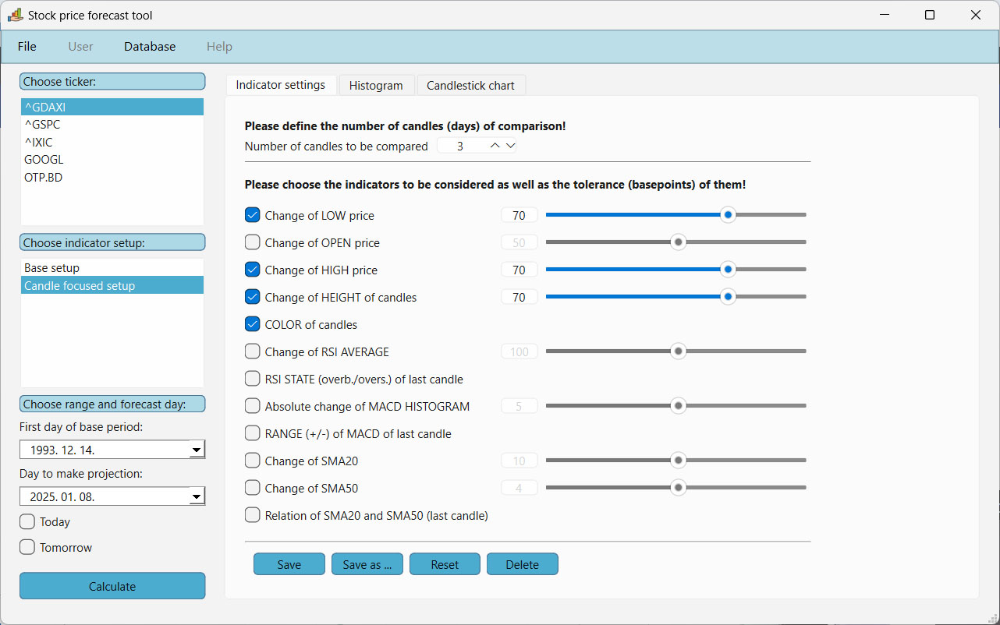
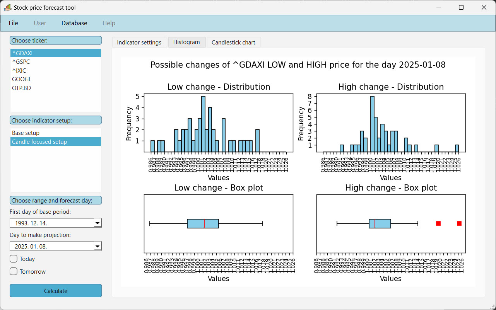
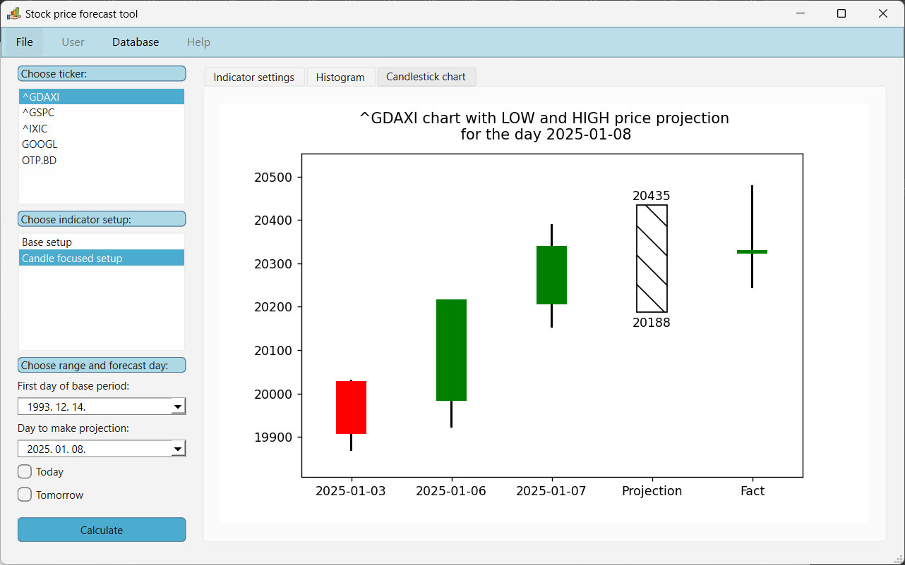

# 📈 Stock Price Forecasting Project  

## 🚀 **Project Overview**  
This is a portfolio project aimed at:  
- Identifying historical stock price patterns similar to recent trends  
- Using these patterns to generate future projections

**Key Technologies**:  
- **Python Libraries**: `Pandas`, `Pandas_ta`, `Matplotlib`, `Yfinance`, `PyQt`  
- **Database**: MongoDB  
- **Visualization**: Candlestick charts, histograms, box plots  

## ⚙️ **Features**  

### 📥 **Data Pipeline**  
- **Automated Data Collection**: Fetches historical data from Yahoo Finance.  
- **Feature Engineering**: Expands DataFrames with technical indicators.  
- **Database Integration**: Stores and retrieves data using MongoDB.  

### 🔍 **Pattern Analysis**  
- **Similarity Search**: Identifies historical patterns matching current trends.  
  

- Adjustable time frames, selectable indicators, customizable tolerance thresholds.  
  

### 📊 **Forecast and Visualization**  
- **Histograms | Box Plots**  
  

- **🎯 Probabilistic Forecasts**  
  Predicts next-day price ranges with probability distributions.  

- **Candlestick Charts**  
  

## 🛠️ **Installation and Usage**  
1. Clone the repository.  
2. Install dependencies:  
```bash  
pip install -r requirements.txt  
```  
3. Ensure MongoDB is running locally at `mongodb://localhost:27017`.  
4. Run `stock_price_forecast.py`.  